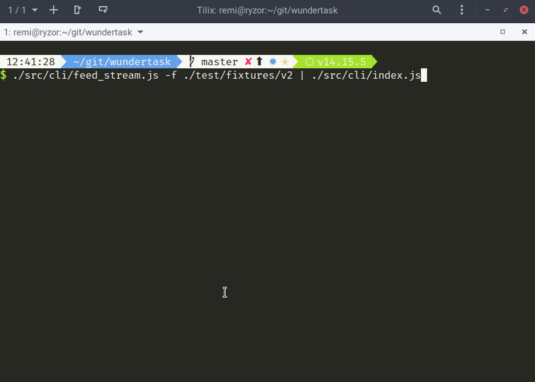

# Wundertask

Basic implementation of the task provided.

## Install

```npm i```

Please note to use modern NodeJS, like 14+ ([nodenv](https://github.com/nodenv/nodenv) recommended).

## CLI

It is possible to use CLI script for playing around. It supports both stream and input parameter modes.

Regular input parameter execution:

`./src/cli/index.js --file ./test/fixtures/v2`

### Pipe through stdin

See how cool the usage can be with streams usage (feed)

`./src/cli/feed_stream.js -f ./test/fixtures/v2 | ./src/cli/index.js`



## Tests

Just run:

```npm run test```

or to experiment with the code and live-execute tests:

```npm run test:w```

It is possible to use `VERBOSE` ENV variable to see logging on the input.

```VERBOSE=1 npm run test:w```


## Questions and controversies about the task

If that was my job task, I'd ask the following questions first:

1. Why length in byte is actually specified within the task whereas parameters are specified by the comma and length of any is relatively low... ? It is actually not event said within the payload structure that the params are indeed separated by the comma, it is just clearly shown within the example payload.
2. Does the payload differ by the Instruction parameter? It looks like that, considering that:

   - Payload structure spec provides other parameters that semantically fit rather just to `DeviceInfo` instruction. Other possible value, `PositionUpdate` would rather expect coordinates or geo are name parameters.
   - Part II indeed specifies other instruction, which is `Error` and it has different parameter set.

3. Just a single controversy: information is uncountable in English. So the function name should be rather `getDeviceInformation`.
