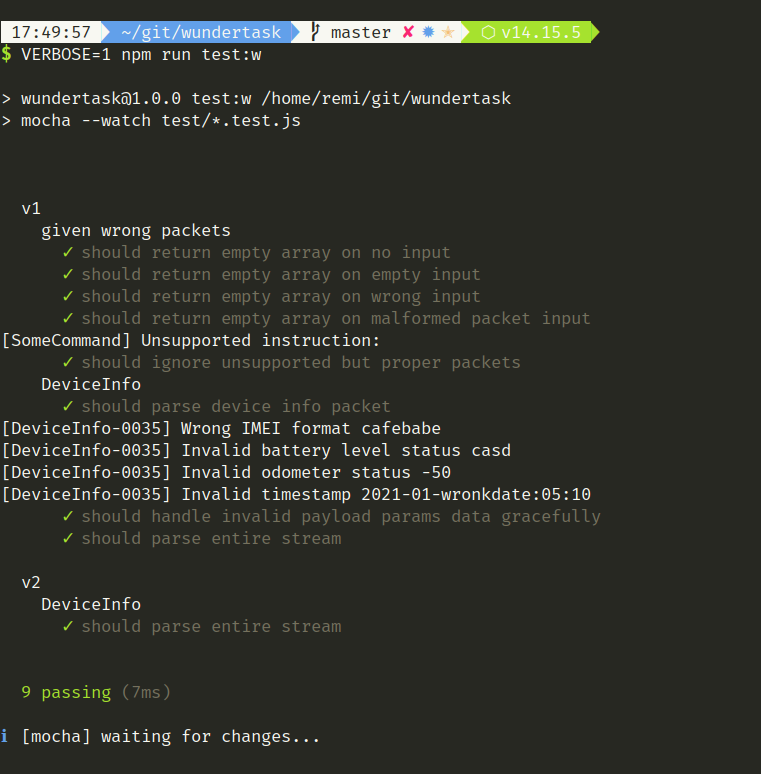

# Wundertask

Basic implementation of the task provided.

## Install

```npm i```

Please note to use modern NodeJS, like 14+ ([nodenv](https://github.com/nodenv/nodenv) recommended).

## Execution

Just run:

```npm run test```

or to experiment with the code and live-execute tests:

```npm run test:w```

It is possible to use `VERBOSE` ENV variable to see logging on the input.

```VERBOSE=1 npm run test:w```


